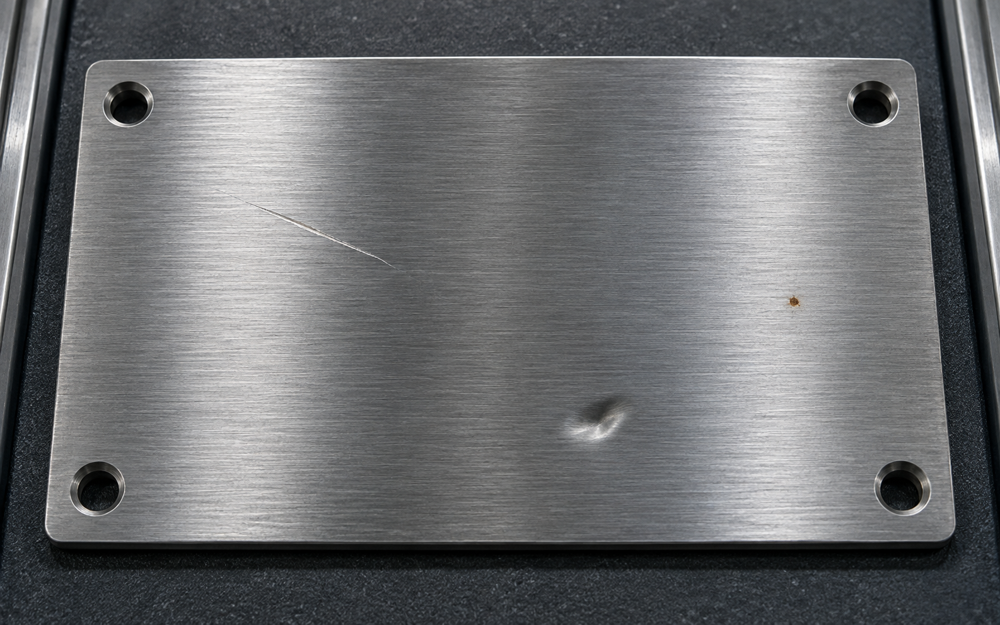

# Visual Inspection Studio

Visual Inspection Studio is a browser-local review console for computer-vision
results. It keeps the product work that matters after inference: confidence
controls, human decisions, notes, audit-friendly exports, and measured run
timing.

[Open the private demo](https://visual-inspection-studio.iibrohimm.chatgpt.site)



## Current release: real local YOLOX inference

The **General Object Detection** workflow runs the official YOLOX-Nano ONNX
model in a Web Worker with ONNX Runtime Web. The model is pinned by SHA-256 in
`lib/detection.ts`, and the browser verifies the downloaded bytes before
inference. No image is uploaded to an API.

It can recognize the 80 COCO object categories, such as people, vehicles,
animals, bottles, furniture, and electronics. It is a general-purpose object
detector; it does **not** recognize scratches, dents, cracks, rust, or other
manufacturing defects. The product deliberately says that limitation instead
of presenting generic object predictions as industrial findings.

The review workflow supports:

- PNG, JPEG, and WebP upload or drag-and-drop (20 MB / 40 megapixel guardrails)
- confidence threshold, class, and review-status filters
- image and table selection with original-image-pixel coordinates
- accept, dismiss, and reviewer notes for every finding
- JSON and CSV exports with model provenance, timing, coordinates, and review state
- a measured evaluation view that does not invent precision, recall, or mAP

## Defect-inspection direction

The mode selector includes **Surface Defect Inspection**, but it is intentionally
shown as **model required** rather than bundled with fake results. A useful
defect detector must be trained or fine-tuned on a known product, camera setup,
and defect taxonomy. Once connected, it can reuse the existing review, notes,
filters, and export workflow.

Our recommended production path is [Anomalib](https://github.com/open-edge-platform/anomalib)
with an Apache-2.0 model such as PatchCore or PaDiM. Train it on approved
normal images from the target line, validate it on labelled defect images,
then export a browser-compatible model and connect its anomaly map to this
same review workflow. This is a better fit for many inspection lines than
pretending a COCO detector understands surface damage.

For a reproducible public benchmark, two useful CC BY 4.0 candidates are:

- [NEU-CLS](https://figshare.com/articles/dataset/NEU-CLS/28903550): 1,800
  grayscale steel images across six defect classes. It is a classification
  benchmark, so it is suitable for a future classifier or training reference,
  not direct bounding-box inference.
- [DsPCBSD+](https://figshare.com/articles/dataset/DsPCBSD_/24970329): PCB
  images with manually annotated defect boxes across nine categories. It is a
  stronger supervised detection benchmark, but its PCB domain should not be
  represented as a metal-surface model.

[KolektorSDD2](https://www.vicos.si/resources/kolektorsdd2/) is a valuable real
industrial dataset, but its CC BY-NC-SA 4.0 terms are not appropriate for
unrestricted commercial redistribution. It should only be used after the
necessary permission is obtained.

## Evidence and limitations

- The included sample is a synthetic image used to make the workflow easy to
  try. Its detections are produced by the pinned model, not hardcoded fixture
  data.
- Inference runs in a browser Web Worker using WASM. The UI reports the actual
  model inference time and total processing time for the current device; the
  first run can include model loading. A sample development run measured about
  173 ms inference on the test machine, but this is not a performance promise.
- Accuracy metrics remain unreported until a labelled validation set and a
  repeatable evaluation script are added.
- Images stay on the local device in this demo. Do not use it as the sole basis
  for safety-critical or high-impact decisions.

Potential client use cases include component presence checks, PPE or equipment
review, visual triage, QA annotation, and a human-in-the-loop front end for a
future customer-specific defect model.

## Phase 1: evaluation harness

The repository now contains the first reproducible layer for the
zero/few-shot study in `lib/evaluation.ts`, `scripts/evaluate.mjs`, and
`evaluation/README.md`. It validates a versioned ground-truth manifest,
assigns deterministic group-aware train/validation/test splits, computes
box-level precision, recall, F1, per-class metrics, 101-point AP, mean AP, and
latency summaries, and provides calibration and selective-risk utilities for
future uncertainty experiments.

Phase 1 deliberately does not contain VLM predictions or accuracy claims. Run
it only with a real manifest and recorded model output:

```bash
npm run evaluate -- --manifest path/to/manifest.json \
  --predictions path/to/predictions.json --split test \
  --output reports/local/run.json
```

The first benchmark domain is DsPCBSD+, a PCB surface-defect dataset with
nine annotated categories. Its source and license are recorded in the harness;
raw images and generated local reports remain outside Git by default.

## Phase 2: zero/few-shot VLM contract

The next layer is a strict, provider-neutral adapter in [`lib/vlm.ts`](lib/vlm.ts)
with its protocol documented in [`vlm/README.md`](vlm/README.md). It supports
zero-shot inspection and exactly 1-, 3-, or 5-shot support examples without
pretending that a model score is a calibrated probability. Responses must use
the frozen DsPCBSD+ labels, pixel-space boxes, evidence, and explicit
uncertainty reasons. Every finding is routed to human review by default.

This milestone intentionally does **not** bundle a hosted model, make up
defect predictions, or change the browser YOLOX workflow. The next step is a
local open-model gateway that implements this contract; only then can we record
real zero/few-shot predictions against the frozen test split and measure
localization, calibration, abstention, and latency.

## Local development

```bash
npm ci
npm run dev
```

Open `http://localhost:5173`.

Quality checks used before release:

```bash
npm run typecheck
npm test
npm run lint
npm run build
```

## Model and runtime attribution

- [YOLOX](https://github.com/Megvii-BaseDetection/YOLOX) and the bundled
  `public/models/yolox_nano.onnx` are distributed under Apache-2.0. The full
  license text is included in `public/models/YOLOX-LICENSE.txt`.
- [ONNX Runtime Web](https://github.com/microsoft/onnxruntime) is used under
  its MIT license. The relevant license text is included in
  `public/models/ONNX-Runtime-LICENSE.txt`.

## License

MIT for this application code. Third-party model, runtime, and dataset terms
remain applicable as described above.
