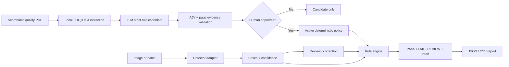

# Visual Inspection Studio

Visual Inspection Studio is a governed computer-vision inspection console. It
turns a searchable quality-spec PDF into evidence-linked rule candidates, keeps
those candidates behind a human approval gate, then applies the approved policy
to real detector findings with a deterministic `PASS`, `FAIL`, or `REVIEW`
trace.

**[Open the hosted demo](https://visual-inspection-studio.iibrohimm.chatgpt.site/)**

The demo performs YOLOX-Nano inference locally in the browser. Images are not
sent to an inference API. PDF text is extracted locally and sent to the
configured OpenAI model only when the user requests rule extraction. The LLM
never makes the final image decision and generated rules never activate
automatically.

## Try the complete workflow in under 30 seconds

1. Select **Load sample**, then **Run detection**.
2. Select a box, inspect the crop, accept or reject the finding, and add a note.
3. Open **Rules & decision** to see the exact policy trace behind the result.
4. Open **Quality spec** and choose **Run example PDF**.
5. Verify every candidate rule against its page and source evidence.
6. Select **Approve & activate policy**; until then, the current policy stays in
   force. Use **Restore default** to reverse the change.
7. Download the JSON/CSV report or open **Batch** for a multi-image queue.

## What the product demonstrates

| Capability | Implementation |
| --- | --- |
| Real inference | Official YOLOX-Nano ONNX model, ONNX Runtime Web, no mocked boxes |
| Clear localization | Selectable boxes, labels, confidence, pixel coordinates, and region zoom |
| Human review | Accept, reject, reset, notes, and unsaved-change protection |
| Runtime contract | `rule-schema.v1.json` is compiled by AJV and enforced before a policy reaches the engine |
| Governed LLM intake | Searchable PDF text → strict JSON → schema validation → source-evidence verification → human approval |
| Deterministic decisions | Approved rules produce PASS, FAIL, or REVIEW with fixed precedence and an ordered decision trace |
| Batch inspection | Up to 12 local images per browser queue with per-image status and latency |
| Inspection reports | Safe JSON and CSV export with model provenance, timings, coordinates, review state, rule outcome, and trace |
| Operational visibility | Model version, execution provider, inference time, total time, and review counts |
| Client adaptation | Reproducible train/validation pipeline and a documented ONNX integration boundary |



## What works today

### Hosted general-object demo

The working browser mode uses the official YOLOX-Nano COCO checkpoint. It
recognizes 80 everyday categories such as people, vehicles, bottles, furniture,
and electronics. It does **not** recognize PCB defects, scratches, dents, rust,
or cracks. Model bytes are pinned by SHA-256 and verified before inference.

### Specialized PCB detector

A separate YOLOX-Nano detector was trained on the DsPCBSD+ PCB defect benchmark
using only the training split. It covers nine annotated defect categories. The
checkpoint is evaluated offline and is not presented as browser inference until
its ONNX export and decoder are verified end to end.

This distinction is deliberate: the interface never relabels generic COCO
predictions as industrial defects and never displays fabricated results.

### Quality-spec PDF → approved rules

The first governed extraction path is working end to end:

1. PDF.js extracts selectable text per page in the browser and creates a
   SHA-256 document fingerprint.
2. The server sends only page-labelled text and the active detector vocabulary
   to the configured model (Terra by default).
3. The Responses API must return the strict
   [`spec-extraction-output-schema.v1.json`](inspection/spec-extraction-output-schema.v1.json)
   shape.
4. The adapter converts that output to the canonical
   [`rule-schema.v1.json`](inspection/rule-schema.v1.json) contract.
5. AJV validates the policy and the application verifies that every evidence
   excerpt occurs on the declared source page.
6. A human reviews and explicitly approves the candidate. Approval is the only
   path that can replace the active policy.
7. The existing deterministic engine—not the LLM—uses the approved rules for
   image decisions.

The MVP deliberately supports searchable PDFs only. Scanned, encrypted,
image-only, oversized, or semantically unsupported requirements fail closed.
For example, a “scratch longer than 2 mm” rule becomes `REVIEW` because the
current detector has neither a scratch class nor calibrated physical-scale
measurement. It is never silently ignored or converted into a fabricated
decision.

### Deterministic inspection rules

The rule engine supports class-specific outcomes and severity, maximum defect
counts, confidence review bands, reviewer corrections, and unsupported
requirements. Conflicts always resolve as `FAIL > REVIEW > PASS`, and reports
contain the ordered reasoning trace. The shipped COCO policy and PCB policy are
explicit examples—not factory acceptance specifications.

See [`inspection/README.md`](inspection/README.md) or run:

```bash
npm run rules:examples
```

### Reproducible example pipeline

The repository includes the same two-page searchable PDF used by the UI:
[`factory-quality-spec-example.pdf`](output/pdf/factory-quality-spec-example.pdf).
It contains supported camera-visible rules plus two requirements that the
current detector cannot verify.

The final browser QA on 2026-09-13 produced seven evidence-linked rules from 2
pages / 2,984 extracted characters in 10.034 seconds using 2,801 total tokens;
the candidate remained inactive until the approval button was selected. The CLI
harness separately verifies that, after its explicit approval step, a synthetic
92% `person` finding produces `FAIL / critical` with
`personnel-exclusion` as the decisive rule. The scratch-measurement and
missing-component requirements remain `REVIEW`. These are integration
observations, not accuracy or latency benchmarks; model output and network
timing can vary.

With `OPENAI_API_KEY` set, reproduce the pipeline with:

```bash
npm run spec:example
```

## Measured detector evidence

The PCB detector was trained on 7,357 DsPCBSD+ training images and evaluated on
851 validation images at class-aware IoU 0.5. The frozen test split remains
sealed.

| Validation profile | Precision | Recall | F1 | Ranked mAP@0.5 |
| --- | ---: | ---: | ---: | ---: |
| Global threshold 0.37 | 69.86% | 66.19% | 67.98% | 69.41% |
| Class-specific, precision-first | 76.97% | 64.53% | 70.20% | 69.41% |

The precision-first profile removes 150 false positives while losing 27 true
positives. It is an operator choice, not a claim that every metric improved.
Full protocol and per-class evidence are in
[`detector/experiments/2026-09-12-yolox-nano-validation.md`](detector/experiments/2026-09-12-yolox-nano-validation.md)
and
[`detector/experiments/2026-09-12-class-thresholds-validation.md`](detector/experiments/2026-09-12-class-thresholds-validation.md).

The earlier Terra hybrid is retained as a negative baseline: it did not improve
the automatic detector and added API cost. See
[`detector/experiments/2026-09-12-hybrid-validation.md`](detector/experiments/2026-09-12-hybrid-validation.md).

### Isolated backend comparison

The application now has a model-agnostic detector contract. YOLOX remains the
only deployed/default browser backend; YOLOv8n is kept in a separate training
and evaluation path because its deployment license has not been selected.

| Detector (256 px, 5 epochs) | Precision | Recall | F1 | mAP@0.5 | Wall latency | Checkpoint |
| --- | ---: | ---: | ---: | ---: | ---: | ---: |
| YOLOX-Nano | 69.86% | 66.19% | 67.98% | 69.41% | 23.32 ms/image | 7.22 MiB |
| YOLOv8n, isolated | 65.03% | 55.52% | 59.90% | 62.15% | 14.33 ms/image | 5.91 MiB |

This first controlled YOLOv8n run is faster, but it does not beat the YOLOX
quality baseline. It therefore remains a reversible experiment rather than a
deployment replacement. See the full protocol and interpretation limits in
[`detector/experiments/2026-09-12-yolox-vs-yolov8n-validation.md`](detector/experiments/2026-09-12-yolox-vs-yolov8n-validation.md).

## Engineering decisions

- Inference runs in a Web Worker, so model work does not block the review UI.
- Browser input has file-type, file-size, pixel-count, timeout, and malformed-output guardrails.
- PDF intake is limited to 10 MB, 25 pages, 15,000 characters per page, and
  80,000 characters total; image-only PDFs are rejected.
- Both JSON schemas are compiled to standalone AJV validators during development
  and checked before production builds. No runtime code generation is required
  in the Cloudflare worker.
- The LLM receives document text as untrusted data, returns a candidate only,
  and is separated from the deterministic decision engine by validation and a
  human approval gate.
- Every document-derived rule retains the PDF fingerprint, source page, and an
  exact evidence excerpt. Evidence mismatches block approval.
- Coordinates remain in original-image pixel space from detection through export.
- CSV values are protected against spreadsheet-formula injection.
- Review changes trigger leave/replace protection until a complete report is exported.
- Model and runtime licenses are stored beside the distributed artifacts.
- Accuracy evidence is split-aware; validation results are never described as test or production performance.

## Adapt it to a client dataset

The detector and review application are intentionally separated. A client
engagement can replace the model without rewriting the operator experience:

1. Define the client’s defect taxonomy, camera setup, acceptance criteria, and
   train/validation/test split before training.
2. Convert labelled images to the versioned manifest described in
   [`evaluation/README.md`](evaluation/README.md).
3. Implement or select a backend through [`lib/detectors/types.ts`](lib/detectors/types.ts),
   then train on `train` and select operating thresholds on `validation` only.
4. Export the approved checkpoint to ONNX and verify preprocessing, output
   decoding, NMS, labels, and a known validation sample.
5. Add the approved ONNX artifact and its checksum to a detector adapter; keep
   experimental or license-unresolved adapters isolated from the deployed registry.
6. Run the browser tests and compare exported coordinates and scores against the
   reference Python inference before deployment.

The current YOLOX adapter uses a 416 × 416 top-left letterbox, BGR CHW float32
values in the 0–255 range, and YOLOX decoding. Detector adapters own their input
contract and decoding, while the review, batch, and reporting components remain
unchanged.

## Local development

```bash
npm ci
npm run schema:check
npm run dev
```

Open `http://localhost:5173`.

To enable PDF rule extraction, provide the secret to the server process. Never
place a real key in source code, tracked JSON, or a committed `.env` file.

```powershell
$env:OPENAI_API_KEY = "your-key"
# Optional; defaults to gpt-5.6-terra
$env:OPENAI_RULE_EXTRACTION_MODEL = "gpt-5.6-terra"
npm run dev
```

Production deployments must configure `OPENAI_API_KEY` as a hosting secret. The
browser never receives it. The extraction request uses `store: false`.

Quality checks:

```bash
npm run typecheck
npm test
npm run lint
npm run schema:check
npm run build
```

Detector training and validation setup is documented in
[`detector/README.md`](detector/README.md). The dataset, checkpoints, predictions,
and local reports stay under ignored `reports/local/` paths.

## Repository map

```text
app/          Inspection and batch-review interface
inspection/   Runtime and strict-extraction schemas plus example policies
lib/          Inference, PDF parsing, rule extraction, validation, and reporting
detector/     Reproducible detector training and validation pipelines
evaluation/   Dataset manifest and split-integrity documentation
output/pdf/   Searchable quality-spec example used by the end-to-end demo
scripts/      Validator generation, example pipeline, and experiment tooling
tests/        Detection, export, evaluation, VLM, and routing tests
vlm/          Preserved VLM baselines and local adapter documentation
```

## Privacy, limitations, and licenses

- The hosted demo processes images in the browser. Do not use it as the sole
  basis for safety-critical decisions.
- PDF text leaves the browser only after the user requests extraction and is
  sent to the configured OpenAI model through the server. Do not upload
  confidential production specifications without an approved data policy.
- The first PDF version does not perform OCR, table reconstruction, unit
  conversion, geometric calibration, or detector retraining. Unclear and
  unsupported requirements route to `REVIEW`.
- A public production deployment needs authentication, rate limiting, audit
  retention policy, and tenant isolation before accepting real client documents.
- First-run timing can include model loading. The UI reports measured time for
  the current device rather than promising a fixed speed.
- DsPCBSD+ is distributed under CC BY 4.0. Raw images are not committed here.
- YOLOX is Apache-2.0; ONNX Runtime is MIT. Their notices are included in
  `public/models/`.
- The isolated YOLOv8 experiment uses Ultralytics 8.3.39 under AGPL-3.0 or
  Ultralytics Enterprise terms; its package, weights, and checkpoints are not
  included in the hosted application or repository.
- Application code is MIT licensed. Third-party model and dataset terms still
  apply.
