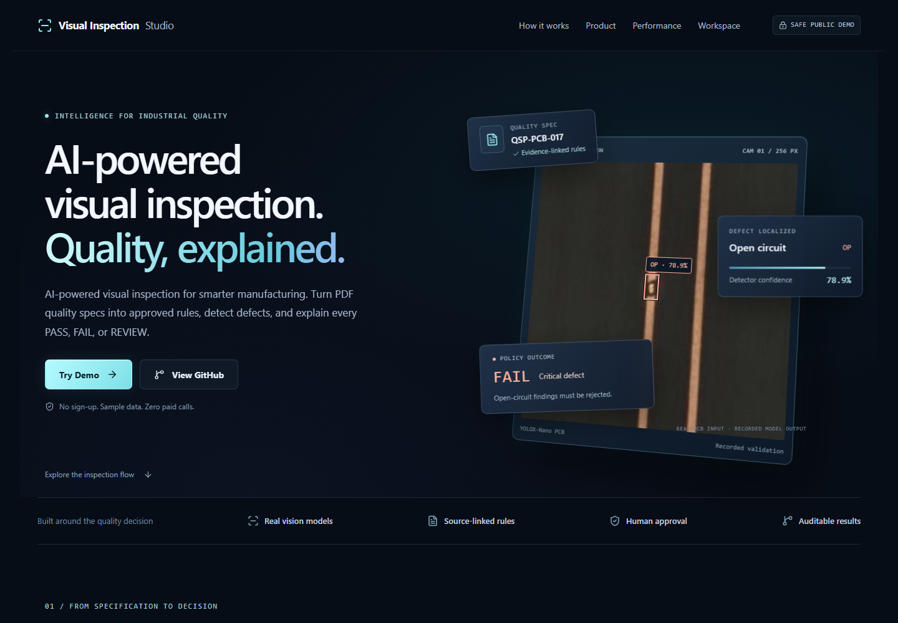
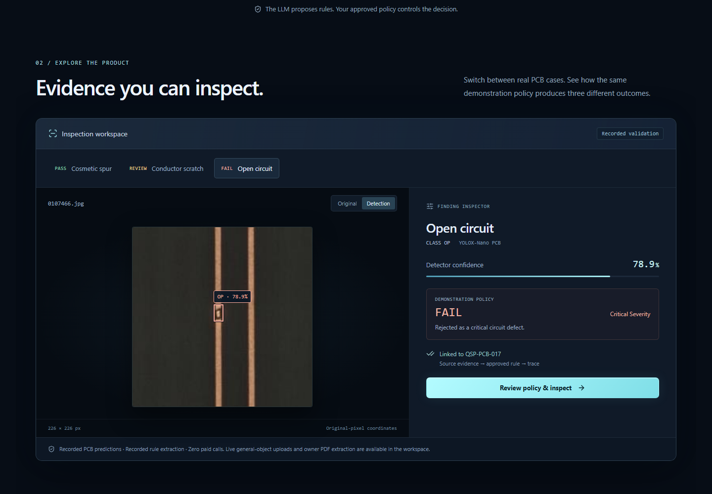
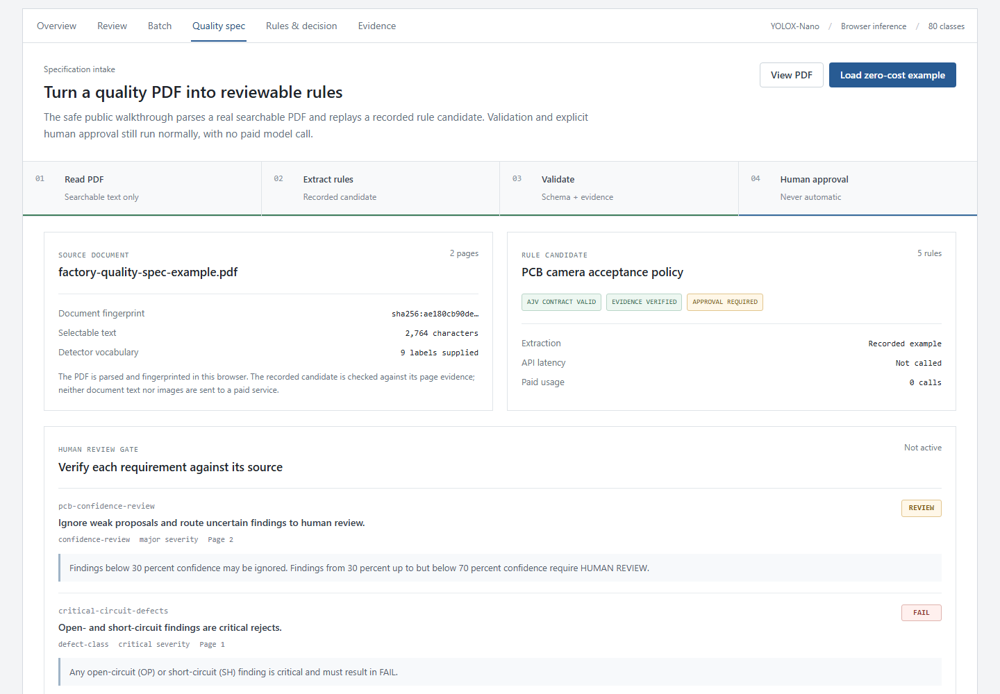
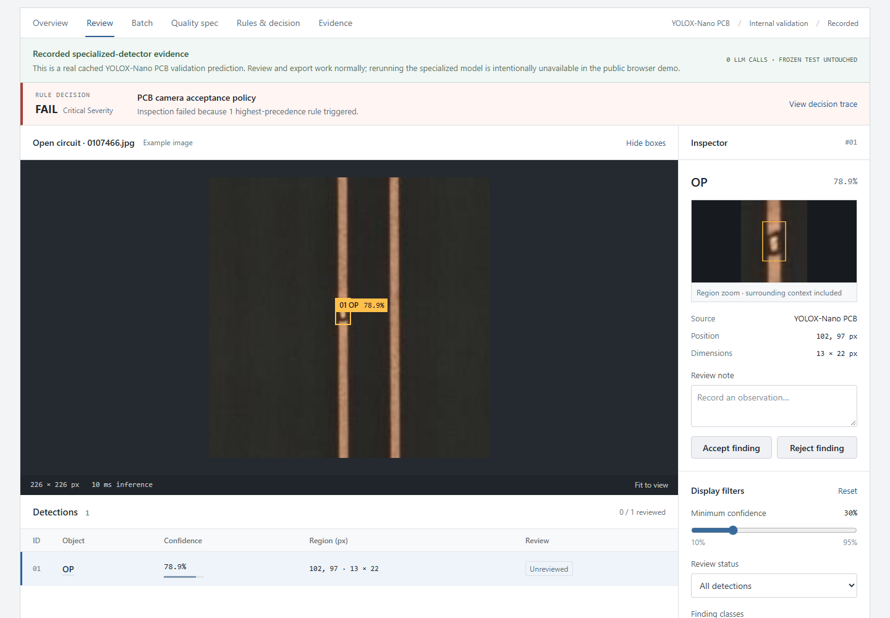
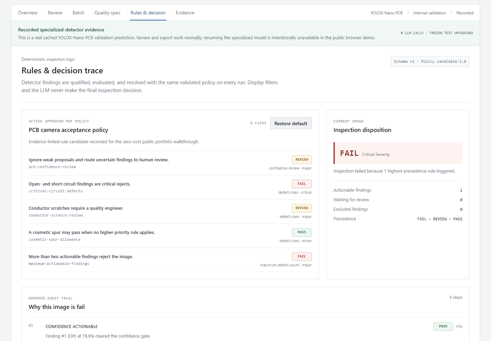
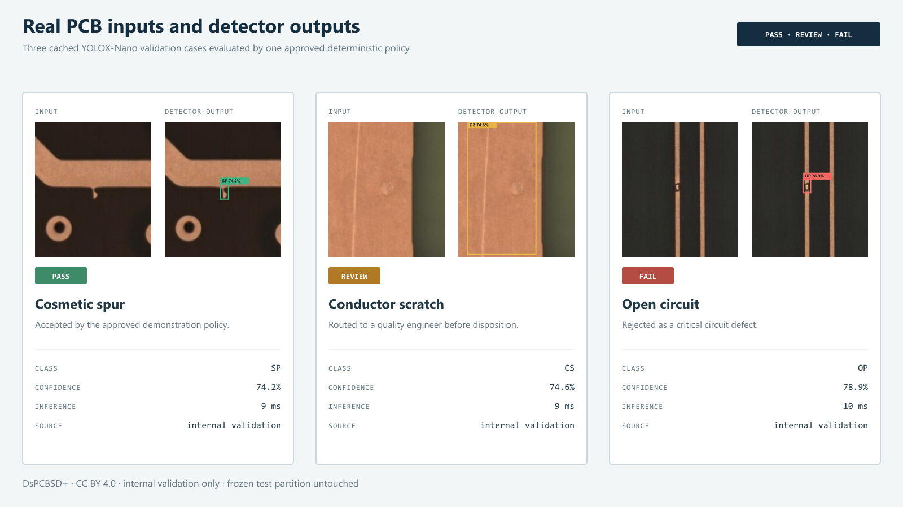
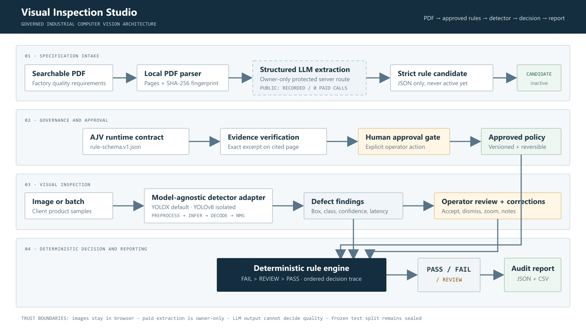

# Visual Inspection Studio



**Quality-spec PDF → approved inspection rules → defect detection → PASS / FAIL / REVIEW → audit-ready report**

[Open the public demo](https://visual-inspection-studio.iibrohimm.chatgpt.site/) · [See the architecture](#engineering-architecture) · [Review measured results](#measured-detector-evidence)

Visual Inspection Studio is a governed computer-vision inspection product. It turns written quality requirements into evidence-linked rule candidates, keeps them behind a human approval gate, applies the approved policy to detector findings, and explains every decision.

It is built for the part clients need after model training: reliable intake, visible defect regions, operator review, deterministic decisions, batch handling, and structured reports.

## Understand it in 30 seconds

1. Select **Try Demo**.
2. Open the real two-page PCB quality specification.
3. Review five extracted rules and their exact page evidence.
4. Select **Approve & activate policy**. Nothing activates before this action.
5. Open the PASS, REVIEW, or FAIL PCB case.
6. Inspect the defect box and zoom, add a review note, then open the decision trace or download JSON/CSV.

The public walkthrough is safe by design: it uses a recorded, schema-valid extraction and three cached internal-validation predictions, so anonymous visitors make **zero paid LLM calls**. Owner mode keeps live quality-PDF extraction available through a server-side identity check.

## What a client gets

| Client need | Product capability |
| --- | --- |
| “Use our written acceptance criteria” | Searchable PDF intake, strict structured extraction, page evidence, and explicit approval |
| “Show me exactly where the defect is” | Selectable boxes, class, confidence, original-pixel coordinates, and region zoom |
| “Do not auto-reject uncertain parts” | Confidence bands, REVIEW routing, accept/dismiss controls, and operator notes |
| “Make decisions consistently” | Versioned rule schema and deterministic `FAIL > REVIEW > PASS` precedence |
| “Process more than one image” | Local batch queue with per-image status, findings, decisions, and latency |
| “Give QA an audit trail” | JSON/CSV reports with model provenance, timings, corrections, outcome, and ordered reasoning trace |
| “Use our own model and defect classes” | Model-agnostic detector adapter and documented ONNX integration boundary |

## Product evidence

### Explore the inspection workflow



The homepage lets visitors switch between PASS, REVIEW, and FAIL examples and compare each original image with its recorded detector output. The presentation uses real PCB imagery, measured model statistics, and a responsive layout with reduced-motion support.

### PDF requirements become reviewable rules



PDF.js extracts and fingerprints the document in the browser. The candidate must satisfy `rule-schema.v1.json`, and every excerpt must exist on its cited page. The policy remains inactive until a person approves it.

### Detector output stays connected to human review



The same workspace supports boxes, confidence filtering, a contextual crop, accept/dismiss actions, notes, and report export. The PCB screenshot is a real cached YOLOX-Nano internal-validation prediction—not a fabricated browser result.

### Every disposition has a deterministic trace



The LLM never decides whether an inspected image passes or fails. The approved policy and detector findings enter a deterministic engine with fixed precedence and an ordered audit trail.

### Three real inputs, three operational outcomes



The three samples come from the internal validation subset of [DsPCBSD+](https://figshare.com/articles/dataset/DsPCBSD_/24970329), used under CC BY 4.0. The official validation partition remains the frozen test split and was not accessed for the public demo.

## Engineering architecture



The architecture separates four responsibilities:

- specification intake translates untrusted document text into a strict candidate;
- governance validates schema and page evidence, then requires explicit approval;
- the detector adapter owns preprocessing, inference, decoding, and NMS;
- the deterministic rule engine combines approved policy, detector findings, and reviewer corrections.

This separation makes the detector replaceable without rewriting the client-facing workflow and prevents an LLM response from becoming a quality decision.

## Safe public mode and owner mode

| Capability | Public demo | Owner live mode |
| --- | --- | --- |
| Sample searchable PCB PDF | Included | Included |
| Rule extraction | Recorded candidate | Live structured LLM call |
| Paid calls | Hard-limited to zero | Allowed for the configured owner only |
| Candidate validation | AJV contract + exact page evidence | AJV contract + exact page evidence |
| Human approval | Required | Required |
| PCB examples | Three real cached validation predictions | Same examples |
| Arbitrary image upload | General COCO detector, in browser | General COCO detector, in browser |
| Arbitrary PDF upload | Disabled | Enabled |

The live `/api/specs/extract` route checks the hosting-provided authenticated-user ID before parsing the request or contacting the model provider. Missing configuration fails closed in production. The API key and owner identifier are hosting secrets and never enter client JavaScript or tracked files.

## What works today

### Public PCB decision walkthrough

- one searchable two-page PCB acceptance-spec example;
- five recorded evidence-linked rules checked against the actual PDF fingerprint;
- explicit approval before activation;
- one PASS spur, one REVIEW conductor scratch, and one FAIL open-circuit case;
- real cached YOLOX-Nano predictions from the internal validation split;
- boxes, confidence controls, crop review, corrections, notes, trace, JSON, and CSV;
- zero public LLM calls and no frozen-test access.

### Live general-object browser inference

The deployed ONNX model is the official YOLOX-Nano COCO checkpoint. It recognizes 80 everyday categories and runs locally with ONNX Runtime Web in a Web Worker. Images do not go to an inference API.

This mode does **not** claim to detect PCB defects, scratches, dents, rust, or cracks. The interface never relabels generic COCO output as industrial findings.

### Owner-only live quality-spec extraction

In owner mode, searchable PDF text is sent through the protected server route to the configured model (Terra by default). The Responses API must return strict JSON. AJV, rule normalization, evidence verification, and human approval all run before the existing deterministic engine can use the policy.

The first version deliberately rejects scanned/image-only, encrypted, oversized, and non-searchable PDFs. Unsupported requirements become `REVIEW`; they are never silently ignored.

### Specialized PCB detector

A separate YOLOX-Nano model was trained on the DsPCBSD+ PCB benchmark using only the training split and evaluated on the internal validation split. The public site exposes selected cached predictions transparently. It does not call those cached samples “live inference,” and it does not ship the specialized checkpoint until browser export and decoder parity are verified end to end.

## Measured detector evidence

YOLOX-Nano was trained on 7,357 DsPCBSD+ training images and evaluated on 851 internal-validation images at class-aware IoU 0.5. The frozen official validation/test partition remains sealed.

| Validation profile | Precision | Recall | F1 | Ranked mAP@0.5 |
| --- | ---: | ---: | ---: | ---: |
| Global threshold 0.37 | 69.86% | 66.19% | 67.98% | 69.41% |
| Class-specific, precision-first | 76.97% | 64.53% | 70.20% | 69.41% |

The precision-first profile removes 150 false positives while losing 27 true positives. It is an operator choice, not a claim that every metric improved. See the full [YOLOX validation protocol](detector/experiments/2026-09-12-yolox-nano-validation.md) and [class-threshold analysis](detector/experiments/2026-09-12-class-thresholds-validation.md).

### Isolated YOLOv8 comparison

YOLOv8n remains an isolated comparison backend because deployment licensing has not been selected. It is not part of the public runtime.

| Detector (256 px, 5 epochs) | Precision | Recall | F1 | mAP@0.5 | Wall latency | Checkpoint |
| --- | ---: | ---: | ---: | ---: | ---: | ---: |
| YOLOX-Nano | 69.86% | 66.19% | 67.98% | 69.41% | 23.32 ms/image | 7.22 MiB |
| YOLOv8n, isolated | 65.03% | 55.52% | 59.90% | 62.15% | 14.33 ms/image | 5.91 MiB |

The first controlled YOLOv8n run is faster but does not beat YOLOX quality, so YOLOX remains the default. See the [comparison protocol](detector/experiments/2026-09-12-yolox-vs-yolov8n-validation.md). The earlier Terra hybrid remains a [negative baseline](detector/experiments/2026-09-12-hybrid-validation.md); it did not improve the automatic detector.

## Implementation details

- **UI/runtime:** React 19, TypeScript, vinext/Next-compatible routing, Cloudflare Workers/Sites
- **Vision:** ONNX Runtime Web, Web Worker inference, model-owned preprocessing and decoding
- **Document intake:** PDF.js, SHA-256 fingerprinting, page-labelled text
- **Governance:** JSON Schema, precompiled AJV standalone validators, exact evidence verification
- **LLM boundary:** strict Responses API output, `store: false`, candidate-only output, owner authorization
- **Decision engine:** class outcomes, severity, maximum counts, confidence review bands, unsupported-rule handling, stable precedence
- **Reports:** original-pixel `xywh`, model provenance, timing, review state, notes, decision evidence, safe CSV cells
- **Quality:** 60 automated tests plus TypeScript, ESLint, schema, production-build, and browser checks

## Adapt it to a client dataset

1. Define the client’s defect taxonomy, camera setup, acceptance criteria, and split protocol.
2. Convert labelled images to the versioned manifest described in [`evaluation/README.md`](evaluation/README.md).
3. Implement a backend through [`lib/detectors/types.ts`](lib/detectors/types.ts).
4. Train only on `train`; select thresholds and routing on `validation`.
5. Export the approved checkpoint to ONNX and verify preprocessing, output decoding, NMS, labels, and reference-sample parity.
6. Register the verified backend while keeping the review, rule, batch, and reporting layers unchanged.
7. Replace the example PDF policy with client-approved requirements and document unsupported capabilities.

## Local development

```bash
npm ci
npm run demo:prepare
npm run dev
```

Open `http://localhost:5173`.

Live owner extraction is optional. Never place real credentials in source code, tracked JSON, or a committed `.env` file.

```powershell
$env:OPENAI_API_KEY = "your-key"
$env:OWNER_ACCOUNT_USER_ID = "your-hosting-user-id"
$env:OPENAI_RULE_EXTRACTION_MODEL = "gpt-5.6-terra" # optional
npm run dev
```

Production uses protected hosting environment variables. Anonymous visitors receive public mode; only the matching authenticated-user ID can reach live extraction.

### Quality checks

```bash
npm run typecheck
npm test
npm run lint
npm run schema:check
npm run build
```

Documentation captures are reproducible while the local server is running:

```bash
node scripts/capture-portfolio.mjs
node scripts/render-portfolio-assets.mjs
```

## Repository map

```text
app/          Product UI and protected server routes
inspection/   Runtime schemas and example policies
lib/          Detectors, PDF intake, validation, rules, authorization, reports
detector/     Reproducible detector training and validation pipelines
evaluation/   Dataset manifest and split-integrity documentation
public/       Browser model plus the safe public PDF/PCB examples
docs/         GitHub and Upwork product captures
scripts/      Dataset, schema, demo, evaluation, and capture tooling
tests/        Detection, authorization, rules, extraction, and demo tests
vlm/          Preserved VLM baselines and adapter documentation
```

## Privacy, limits, and licenses

- Public users cannot trigger the paid LLM endpoint; owner authorization is enforced on the server.
- Public PDF replay and PCB examples are non-confidential bundled assets.
- Owner-mode PDF text leaves the browser only after an owner requests extraction. Do not process confidential specifications without an approved data policy.
- The app is a portfolio engineering demo, not a certified factory quality system or a basis for safety-critical decisions.
- Physical measurements require calibrated optics and scale metadata. Missing-part checks require a validated reference assembly or presence detector.
- Only three attributed DsPCBSD+ internal-validation examples are committed; the raw dataset remains local. DsPCBSD+ is CC BY 4.0.
- YOLOX is Apache-2.0 and ONNX Runtime is MIT; notices are stored beside distributed model assets.
- The isolated Ultralytics experiment is subject to AGPL-3.0 or Ultralytics Enterprise terms and is not distributed in the hosted application.
- Application code is MIT licensed. Third-party model and dataset terms still apply.
