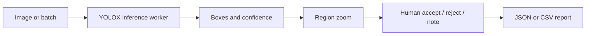

# Visual Inspection Studio

Visual Inspection Studio is a production-style computer-vision review console:
upload images, run a real detector, inspect localized findings, record a human
decision, and download structured inspection reports.

**[Open the hosted demo](https://visual-inspection-studio.iibrohimm.chatgpt.site/)**

The demo performs YOLOX-Nano inference locally in the browser. Images are not
sent to an inference API. The same review surface is designed to accept a
client-specific defect detector without rebuilding the operator workflow.

## Try the complete workflow in under 30 seconds

1. Select **Load sample**, then **Run detection**.
2. Select a box to inspect the magnified region and pixel coordinates.
3. Accept or reject the finding and add a reviewer note.
4. Change the confidence threshold to see the operating-point tradeoff.
5. Download the JSON or CSV inspection report.
6. Open **Batch** to process several local images in one queue.

## What the product demonstrates

| Capability | Implementation |
| --- | --- |
| Real inference | Official YOLOX-Nano ONNX model, ONNX Runtime Web, no mocked boxes |
| Clear localization | Selectable boxes, labels, confidence, pixel coordinates, and region zoom |
| Human review | Accept, reject, reset, notes, and unsaved-change protection |
| Batch inspection | Up to 12 local images per browser queue with per-image status and latency |
| Inspection reports | Safe JSON and CSV export with model provenance, timings, coordinates, filters, and decisions |
| Operational visibility | Model version, execution provider, inference time, total time, and review counts |
| Client adaptation | Reproducible train/validation pipeline and a documented ONNX integration boundary |



## What works today

### Hosted general-object demo

The working browser mode uses the official YOLOX-Nano COCO checkpoint. It
recognizes 80 everyday categories such as people, vehicles, bottles, furniture,
and electronics. It does **not** recognize PCB defects, scratches, dents, rust,
or cracks. Model bytes are pinned by SHA-256 and verified before inference.

### Specialized PCB detector

A separate YOLOX-Nano detector was trained on the DsPCBSD+ PCB defect benchmark
using only the training split. It covers nine annotated defect categories. The
checkpoint is evaluated offline and is not presented as browser inference until
its ONNX export and decoder are verified end to end.

This distinction is deliberate: the interface never relabels generic COCO
predictions as industrial defects and never displays fabricated results.

## Measured detector evidence

The PCB detector was trained on 7,357 DsPCBSD+ training images and evaluated on
851 validation images at class-aware IoU 0.5. The frozen test split remains
sealed.

| Validation profile | Precision | Recall | F1 | Ranked mAP@0.5 |
| --- | ---: | ---: | ---: | ---: |
| Global threshold 0.37 | 69.86% | 66.19% | 67.98% | 69.41% |
| Class-specific, precision-first | 76.97% | 64.53% | 70.20% | 69.41% |

The precision-first profile removes 150 false positives while losing 27 true
positives. It is an operator choice, not a claim that every metric improved.
Full protocol and per-class evidence are in
[`detector/experiments/2026-09-12-yolox-nano-validation.md`](detector/experiments/2026-09-12-yolox-nano-validation.md)
and
[`detector/experiments/2026-09-12-class-thresholds-validation.md`](detector/experiments/2026-09-12-class-thresholds-validation.md).

The earlier Terra hybrid is retained as a negative baseline: it did not improve
the automatic detector and added API cost. See
[`detector/experiments/2026-09-12-hybrid-validation.md`](detector/experiments/2026-09-12-hybrid-validation.md).

### Isolated backend comparison

The application now has a model-agnostic detector contract. YOLOX remains the
only deployed/default browser backend; YOLOv8n is kept in a separate training
and evaluation path because its deployment license has not been selected.

| Detector (256 px, 5 epochs) | Precision | Recall | F1 | mAP@0.5 | Wall latency | Checkpoint |
| --- | ---: | ---: | ---: | ---: | ---: | ---: |
| YOLOX-Nano | 69.86% | 66.19% | 67.98% | 69.41% | 23.32 ms/image | 7.22 MiB |
| YOLOv8n, isolated | 65.03% | 55.52% | 59.90% | 62.15% | 14.33 ms/image | 5.91 MiB |

This first controlled YOLOv8n run is faster, but it does not beat the YOLOX
quality baseline. It therefore remains a reversible experiment rather than a
deployment replacement. See the full protocol and interpretation limits in
[`detector/experiments/2026-09-12-yolox-vs-yolov8n-validation.md`](detector/experiments/2026-09-12-yolox-vs-yolov8n-validation.md).

## Engineering decisions

- Inference runs in a Web Worker, so model work does not block the review UI.
- Browser input has file-type, file-size, pixel-count, timeout, and malformed-output guardrails.
- Coordinates remain in original-image pixel space from detection through export.
- CSV values are protected against spreadsheet-formula injection.
- Review changes trigger leave/replace protection until a complete report is exported.
- Model and runtime licenses are stored beside the distributed artifacts.
- Accuracy evidence is split-aware; validation results are never described as test or production performance.

## Adapt it to a client dataset

The detector and review application are intentionally separated. A client
engagement can replace the model without rewriting the operator experience:

1. Define the client’s defect taxonomy, camera setup, acceptance criteria, and
   train/validation/test split before training.
2. Convert labelled images to the versioned manifest described in
   [`evaluation/README.md`](evaluation/README.md).
3. Implement or select a backend through [`lib/detectors/types.ts`](lib/detectors/types.ts),
   then train on `train` and select operating thresholds on `validation` only.
4. Export the approved checkpoint to ONNX and verify preprocessing, output
   decoding, NMS, labels, and a known validation sample.
5. Add the approved ONNX artifact and its checksum to a detector adapter; keep
   experimental or license-unresolved adapters isolated from the deployed registry.
6. Run the browser tests and compare exported coordinates and scores against the
   reference Python inference before deployment.

The current YOLOX adapter uses a 416 × 416 top-left letterbox, BGR CHW float32
values in the 0–255 range, and YOLOX decoding. Detector adapters own their input
contract and decoding, while the review, batch, and reporting components remain
unchanged.

## Local development

```bash
npm ci
npm run dev
```

Open `http://localhost:5173`.

Quality checks:

```bash
npm run typecheck
npm test
npm run lint
npm run build
```

Detector training and validation setup is documented in
[`detector/README.md`](detector/README.md). The dataset, checkpoints, predictions,
and local reports stay under ignored `reports/local/` paths.

## Repository map

```text
app/          Inspection and batch-review interface
lib/          Browser inference, reporting, evaluation, and routing logic
detector/     Reproducible detector training and validation pipelines
evaluation/   Dataset manifest and split-integrity documentation
tests/        Detection, export, evaluation, VLM, and routing tests
vlm/          Preserved VLM baselines and local adapter documentation
```

## Privacy, limitations, and licenses

- The hosted demo processes images in the browser. Do not use it as the sole
  basis for safety-critical decisions.
- First-run timing can include model loading. The UI reports measured time for
  the current device rather than promising a fixed speed.
- DsPCBSD+ is distributed under CC BY 4.0. Raw images are not committed here.
- YOLOX is Apache-2.0; ONNX Runtime is MIT. Their notices are included in
  `public/models/`.
- The isolated YOLOv8 experiment uses Ultralytics 8.3.39 under AGPL-3.0 or
  Ultralytics Enterprise terms; its package, weights, and checkpoints are not
  included in the hosted application or repository.
- Application code is MIT licensed. Third-party model and dataset terms still
  apply.
